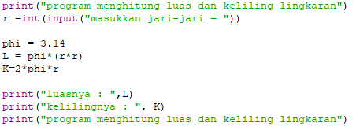
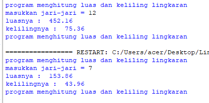
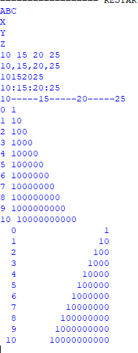
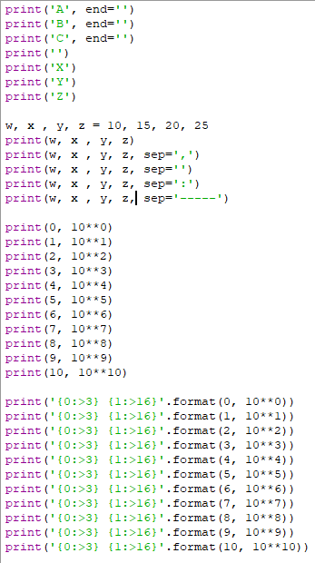

# praktikum 3

## 3.1 Code program luas dan keliling lingkaran
#### dalam lingkaran ada yang dinamakan phi(π) merupakan 1 satuan dalam lingkaran yang milikin nilai 22/7 atau 3,14, luas dan keliling lingkaran bisa dihitung mengunakan rumus K=2πr dan L=πrr maka dari itu kita bisa memasukan code input seperti ini

#### setelah dimasukan seperti yang diatas, silakan melakukan run dan akan menghsilkan output seprti ini

## 3.2 latihan praktikum 3
### 3.2.1 penggunaan End Separator & string format
secara berurut masukan input

